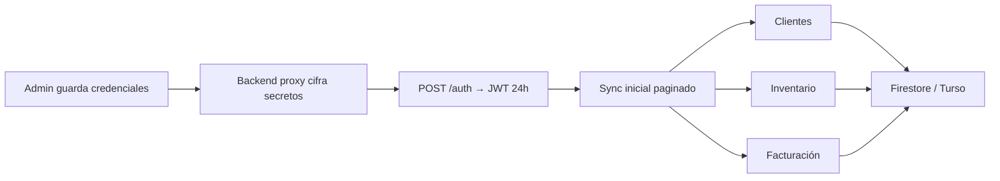

# Guía de APIs e integraciones — SPE

Registro de cómo obtener las credenciales de cada integración del panel **APIs** (`/integraciones`), qué ocurre al configurarlas en SPE y qué datos se conectan cuando la API está activa.

> **Estado actual del proyecto:** las integraciones funcionan en **modo demo** (simulación sin llamadas HTTP reales). Las credenciales se guardan en el navegador (`localStorage`). En producción deben ir cifradas en un servidor proxy (Cloud Functions / backend).

---

## Acceso al panel

| Rol | Permiso |
|-----|---------|
| `administrador`, `super_admin` | Configurar credenciales, conectar, probar, sincronizar |
| `supervisor_sitio`, `trabajador` | Solo lectura del estado de conexión |

Ruta: **Panel Admin → APIs** (`/integraciones`).

---

## Flujo común al introducir credenciales

1. El administrador expande la tarjeta de la integración.
2. Ingresa campos manualmente **o** sube un archivo `.json` / `.env`.
3. Pulsa **Guardar credenciales** → se persisten en `spe-credenciales-integraciones` (demo).
4. Pulsa **Guardar y conectar** → el conector valida que haya datos y marca estado `conectado`.
5. **Probar conexión** → ping simulado (demo) o llamada real (producción futura).
6. **Sincronizar datos demo** → trae datos de ejemplo al registro de actividad (demo).

**Importante (demo):** el estado `conectado` vive en memoria del navegador. Si recargas la página, puede mostrar `desconectado` aunque las credenciales sigan guardadas. Vuelve a pulsar **Guardar y conectar**.

---

## 1. Siigo Nube (contabilidad y facturación)

### Para qué sirve en SPE

Conecta la contabilidad de Siigo con los módulos internos:

| Dato en Siigo API | Módulo SPE | Uso |
|-------------------|------------|-----|
| `GET /v1/customers` | **Clientes** | Cartera, NIT, contactos |
| `GET /v1/products` | **Inventario** | Productos, precios, stock |
| `GET /v1/invoices` | **Facturación** | Facturas electrónicas, estados de cobro |
| `GET /v1/credit-notes` | **Facturación** | Notas crédito |
| `GET /v1/vouchers` | **Facturación** | Recibos de caja |
| Catálogos (impuestos, formas de pago) | Configuración | Emisión de facturas desde SPE |

Documentación oficial: https://developers.siigo.com/docs/siigoapi/

### Cómo obtener las credenciales

1. Inicia sesión en **Siigo Nube** con usuario **administrador**.
2. Ve a **Configuración → Alianzas e integraciones → Credenciales de integración a plataformas digitales (Siigo API)**.
   - Atajo clásico: menú **Alianzas → Mi credencial API**.
3. Registra tu aplicación (nombre real, sin “prueba” ni “sandbox” genérico).
4. Obtendrás:
   - **Usuario API** (`username`) — correo o usuario asignado.
   - **Access Key** (`access_key`) — clave secreta; puedes restablecerla desde Siigo.
   - **Partner-Id** — identificador de tu software (3–100 caracteres alfanuméricos, camelCase, sin espacios). Obligatorio en **todas** las peticiones.

Portal de ayuda: https://siigonube.portaldeclientes.siigo.com/generar-credenciales-api/

**Ambiente de pruebas:** contacta a Siigo con el NIT de la empresa; envían credenciales de sandbox por correo.

### Qué ingresar en SPE (panel APIs)

| Campo en SPE | Campo Siigo | Obligatorio |
|--------------|-------------|-------------|
| Usuario / email Siigo | `username` | Sí |
| Access Key | `access_key` | Sí |
| Partner-Id | Header `Partner-Id` | Sí en producción |

También puedes subir un `.env`:

```env
SIIGO_USERNAME=contabilidad@tuempresa.com
SIIGO_ACCESS_KEY=tu_access_key
SIIGO_PARTNER_ID=speEventosErp
```

O un `.json` con esos mismos campos.

### Autenticación (cómo se conecta la API)

```
POST https://api.siigo.com/auth
Content-Type: application/json
Partner-Id: speEventosErp

{
  "username": "contabilidad@tuempresa.com",
  "access_key": "tu_access_key"
}
```

Respuesta:

```json
{
  "access_token": "...",
  "expires_in": 86400,
  "token_type": "Bearer",
  "scope": "Siigo API"
}
```

Peticiones siguientes:

```
GET https://api.siigo.com/v1/customers
Authorization: Bearer <access_token>
Partner-Id: speEventosErp
```

El token JWT dura **24 horas**. En producción SPE debe renovarlo automáticamente antes de expirar.

### Qué pasa al conectar Siigo en SPE

**Hoy (demo):**

- Valida que `username` + `access_key` no estén vacíos.
- Muestra mensaje: *“Sincronización demo: 12 facturas, 8 clientes”*.
- **Sincronizar datos demo** devuelve 2 facturas de ejemplo; **no** escribe aún en Clientes / Facturación.

**Producción (diseño objetivo):**



1. **Sync inicial** (paginado): clientes → `Cliente`, productos → `Producto`, facturas → `Factura`.
2. **Sync incremental** (cron o webhook Siigo si disponible): solo cambios desde `ultimaSync`.
3. **Restricciones respetadas:**
   - **Rate limit:** ~100 req/min (producción), ~10 req/min (pruebas).
   - **Partner-Id** en cada request.
   - **Paginación** obligatoria en listados grandes.
   - **DIAN / facturación electrónica:** campos CUFE, resolución y estados tributarios se conservan en el mapeo; no se omiten en facturas emitidas.
   - **Permisos Siigo:** solo lectura si el usuario API no tiene permisos de escritura; SPE no intenta crear facturas sin rol explícito.

### Restricciones y errores frecuentes

| Error | Causa | Acción |
|-------|-------|--------|
| 401 Unauthorized | Access Key inválida o token expirado | Renovar token; restablecer Access Key en Siigo |
| 403 | Usuario sin permisos en Siigo Nube | Usar cuenta administrador Siigo |
| 429 Too Many Requests | Límite de peticiones | Esperar y reintentar con backoff |
| Partner-Id rechazado | Nombre genérico o no registrado | Registrar app real en Siigo Alianzas |

---

## 2. WhatsApp Cloud API (Meta)

### Para qué sirve en SPE

Mensajes a trabajadores, alertas de turno, notificaciones operativas.

### Cómo obtener las credenciales

1. Crea una app en **Meta for Developers**: https://developers.facebook.com/
2. Añade el producto **WhatsApp**.
3. En **WhatsApp → API Setup** obtienes:
   - **Token permanente** (System User o token de app).
   - **Phone Number ID**
   - **WhatsApp Business Account ID** (opcional en SPE)
4. Configura **Webhook** en tu servidor HTTPS:
   - URL pública (no puede ser solo el navegador).
   - **Verify token** que tú defines.

Documentación: https://developers.facebook.com/docs/whatsapp/cloud-api/

### Qué ingresar en SPE

| Campo SPE | Descripción |
|-----------|-------------|
| Token permanente Cloud API | Bearer token |
| Phone Number ID | ID del número de WhatsApp Business |
| WhatsApp Business Account ID | Cuenta WABA |
| URL webhook | Endpoint de tu servidor |
| Verify token webhook | Token de verificación Meta |

### Qué pasa al conectar

**Demo:** simula bandeja con mensajes de ejemplo.

**Producción:** requiere servidor que reciba webhooks Meta; SPE enviaría plantillas aprobidas (`sendTemplate`). Restricciones Meta: ventana de 24 h para mensajes libres, plantillas para iniciar conversación, límites por tier de calidad.

---

## 3. Facebook (página)

### Cómo obtener credenciales

1. App en Meta for Developers.
2. Producto **Facebook Login** + permisos de página (`pages_read_engagement`, `pages_messaging`, etc.).
3. Genera **Page Access Token** de larga duración.
4. Obtén **App ID**, **App Secret**, **Page ID**.

### Qué ingresar en SPE

App ID, App Secret, Page Access Token, Page ID.

### Qué pasa al conectar

**Demo:** una actividad social simulada.

**Producción:** lectura de comentarios/mensajes de la página; publicación requiere permisos adicionales y revisión de Meta.

---

## 4. Instagram (cuenta profesional)

### Cómo obtener credenciales

1. Misma app Meta vinculada a cuenta **Instagram Business**.
2. Token con permisos `instagram_basic`, `instagram_manage_messages` (según caso).
3. **Instagram Business Account ID** (distinto del Page ID).

### Qué ingresar en SPE

App ID, App Secret, Instagram Access Token, Instagram Business Account ID.

### Qué pasa al conectar

Igual que Facebook: demo con actividad simulada; producción vía Graph API con límites de rate y permisos.

---

## 5. Webhook entrante

### Para qué sirve

Recibir eventos de sistemas externos (formularios web, ERP, IoT) en SPE.

### Cómo configurar

1. Despliega un endpoint HTTPS en tu servidor, por ejemplo `https://tu-dominio.com/api/webhooks/spe`.
2. Define un **secret HMAC** para validar firmas.
3. Opcional: **verify token** para handshake inicial.

### Qué ingresar en SPE

URL endpoint entrante, Secret/firma HMAC, Token verificación.

### Qué pasa al conectar

**Demo:** lista un evento ficticio.

**Producción:** el servidor recibe POST, valida firma, guarda en `WebhookEvento` y procesa (crear turno, alerta, etc.). El panel SPE solo **configura** la URL esperada; el receptor debe estar en backend.

---

## 6. Formulario web (`web_form`) — planificado

Tipo definido en el código pero **sin conector activo** aún. Campos previstos: URL del formulario y API Key del sitio. Cuando se implemente, enviará leads o registros al mismo pipeline que webhooks.

---

## Mapa rápido: credencial → módulo SPE

| Integración | Credenciales clave | Módulos alimentados |
|-------------|-------------------|---------------------|
| **Siigo** | username, access_key, Partner-Id | Clientes, Inventario, Facturación |
| **WhatsApp** | token, phone_number_id | Notificaciones, alertas |
| **Facebook** | app_id, token, page_id | Actividad social / mensajes |
| **Instagram** | app_id, token, ig_business_id | Actividad social / DMs |
| **Webhook** | url, secret | Eventos externos → operación |
| **web_form** | url, api_key | Leads web (futuro) |

---

## Producción: checklist antes de ir en vivo

- [ ] Mover credenciales del navegador a **backend cifrado** (nunca en el cliente en producción).
- [ ] Implementar proxy Siigo con renovación de JWT y `Partner-Id` fijo `speEventosErp` (o el registrado).
- [ ] Paginación y rate limiting en sync Siigo.
- [ ] Webhook Meta/WhatsApp en servidor con HTTPS válido.
- [ ] Mapeo completo Siigo → tipos `Cliente`, `Producto`, `Factura` en `@spe/shared`.
- [ ] Logs de auditoría en **Master → Auditoría** para cada sync.

---

## Referencias

- Siigo API: https://developers.siigo.com/docs/siigoapi/
- Siigo autenticación: https://developers.siigo.com/docs/siigoapi/autenticacion/autenticacion/
- Siigo Partner-Id: https://developers.siigo.com/docs/siigoapi/partner-id/
- Meta WhatsApp Cloud API: https://developers.facebook.com/docs/whatsapp/cloud-api/
- Código SPE: `packages/integrations/`, `apps/admin/src/pages/IntegracionesPage.tsx`
